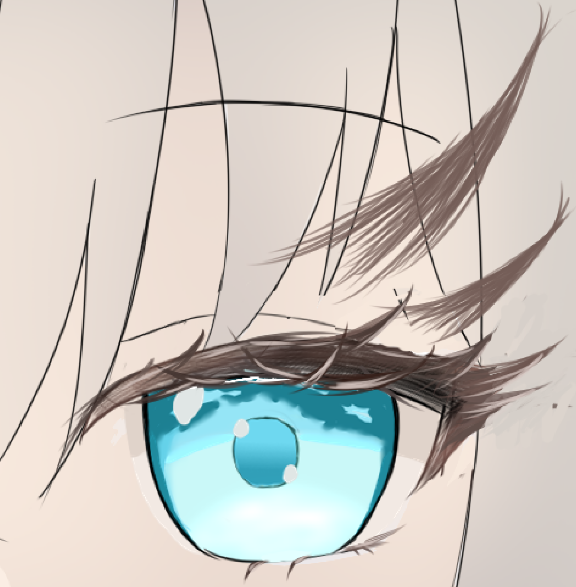
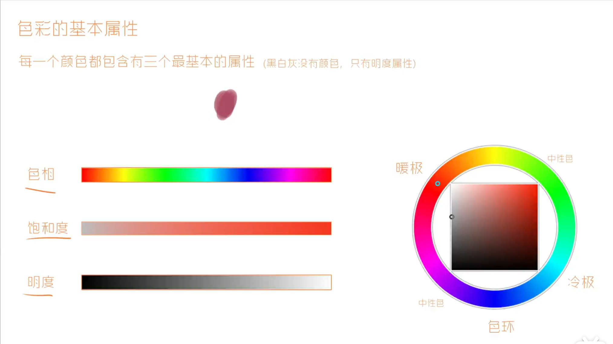
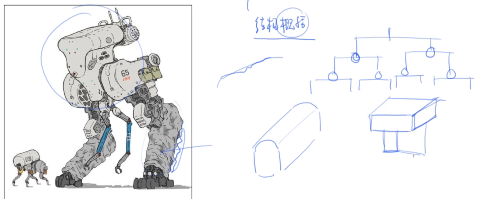
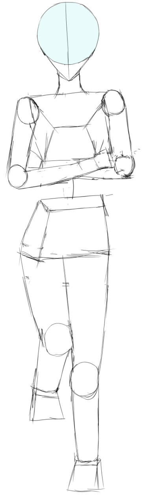
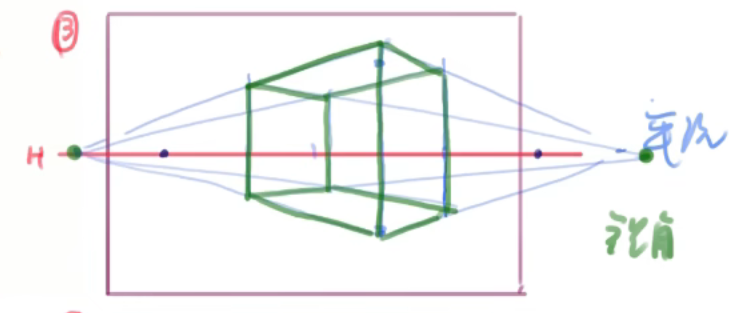
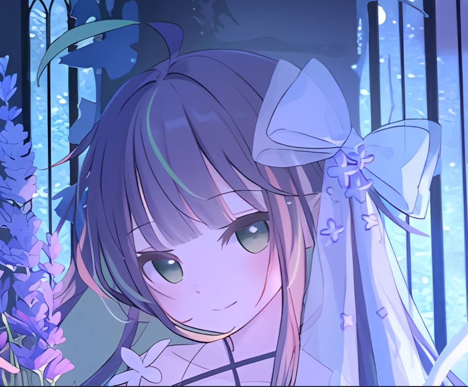

---
hide:
  - toc
---

# 绘画笔记

    <section class="home-hero">
        

            
DRAWING ROUTE / VISUAL ARCHIVE

            
绘画路线档案

            
把起草、勾线、上色、塑造和专题拆成一条能反复回看的绘画路线。先抓人体和空间，再整理明暗、色彩与材质，画到卡住的时候可以直接跳回对应节点。

            

                <a class="home-action home-action--primary" href="流程/起草.html">01从起草开始</a>
                <a class="home-action home-action--cyan" href="专题/眼睛上色.html">02眼睛专题</a>
                <a class="home-action home-action--dark" href="色彩知识.html">03色彩整理</a>
            

            

                

                    <strong>03</strong>
                    基础板块
                

                

                    <strong>11</strong>
                    流程节点
                

                

                    <strong>05</strong>
                    专题笔记
                

            

        

        

            
            
            
        

    </section>

    <section class="home-news">
        <a href="人体知识.html">FOUNDATION人体结构、体块和比例</a>
        <a href="场景知识.html">SPACE透视、场景和构图</a>
        <a href="色彩知识.html">COLOR色相、明暗和图层</a>
    </section>

    <section class="route-panel">
        

            

                
LEARNING ROUTE

                
按作画顺序复盘，每一步都能回头查

            

            
从大结构到最后提亮，先把流程跑通，再回到专题页拆细节。

        

        

            <a class="flow-step" href="流程/起草.html">01起草<small>动态与体块</small></a>
            <a class="flow-step" href="流程/勾线.html">02勾线<small>线条取舍</small></a>
            <a class="flow-step" href="流程/固有色.html">03固有色<small>灰底铺色</small></a>
            <a class="flow-step" href="流程/二分.html">04二分<small>明暗分组</small></a>
            <a class="flow-step" href="流程/三分.html">05三分<small>弱结构补色</small></a>
            <a class="flow-step" href="流程/闭塞.html">06闭塞<small>接触暗部</small></a>
            <a class="flow-step" href="流程/灰面.html">07灰面<small>过渡塑形</small></a>
            <a class="flow-step" href="流程/高光.html">08高光<small>最后提亮</small></a>
        

    </section>

    <section class="home-section">
        

            
CORE FILES

            <h2>基础知识</h2>
        

        

            <a class="hero-card" href="人体知识.html">
                
                

                    体
                    FOUNDATION
                

                
人体知识

                
比例、头肩颈、躯干和四肢体块，把角色从火柴人推到能塑造的结构。

                查看人体结构
            </a>
            <a class="hero-card" href="场景知识.html">
                
                

                    景
                    SPACE
                

                
场景知识

                
一点、两点、三点透视和结构概括，用空间关系托住人物。

                查看场景透视
            </a>
            <a class="hero-card" href="色彩知识.html">
                
                

                    色
                    COLOR
                

                
色彩知识

                
白色偏好、正片叠底、滤色和叠加，把图层混合变成可控工具。

                查看色彩笔记
            </a>
        

    </section>

    <section class="home-section">
        

            
PROCESS MAP

            <h2>绘画流程</h2>
        

        

            <a class="hero-card" href="流程/起草.html">
                
起STEP 01

                
起草

                
人体动态、体块概括、透视线，先把大结构立住。

                开始学习
            </a>
            <a class="hero-card" href="流程/勾线.html">
                
线STEP 02

                
勾线

                
粗细变化、闭塞、断线和蒙版，控制线稿的轻重与呼吸。

                查看流程
            </a>
            <a class="hero-card" href="流程/固有色.html">
                
底STEP 03

                
固有色

                
灰底铺色、固有色选择和特殊处理，先定画面的颜色秩序。

                查看流程
            </a>
            <a class="hero-card" href="流程/二分.html">
                
明STEP 04

                
二分

                
光源判断、阴影细化、叠加染色，把明暗关系分清楚。

                查看流程
            </a>
            <a class="hero-card" href="流程/三分.html">
                
三STEP 05

                
三分

                
腮红、弱结构阴影、眼白眼影和嘴唇，补上更细的色面变化。

                查看流程
            </a>
            <a class="hero-card" href="流程/闭塞.html">
                
暗STEP 06

                
闭塞

                
接触面、转折处、遮挡处，让暗部更有重量。

                查看流程
            </a>
            <a class="hero-card" href="流程/灰面.html">
                
灰STEP 07

                
灰面

                
选区笔刷、眼睫毛、眼球和头发画法，把过渡与塑形补齐。

                查看流程
            </a>
            <a class="hero-card" href="流程/高光.html">
                
光STEP 08

                
高光

                
面部高光和图层混合模式，让最后的亮点干净落位。

                查看流程
            </a>
        

        

            <a class="pending-link" href="流程/反光.html">待补完：反光</a>
            <a class="pending-link" href="流程/塑造.html">待补完：塑造</a>
            <a class="pending-link" href="流程/光源衰减.html">待补完：光源衰减</a>
        

    </section>

    <section class="home-section">
        

            
DETAIL TRAINING

            <h2>专题深入</h2>
        

        

            <a class="hero-card" href="专题/眼睛上色.html">
                
                
眼DETAIL

                
眼睛上色

                
瞳孔、虹膜、高光、反光和睫毛，处理角色最先被注意到的区域。

                阅读专题
            </a>
            <a class="hero-card" href="专题/头发塑造.html">
                
                
发FORM

                
头发塑造

                
二分细化、灰面、高光、反光和线稿染色，梳理发束体积。

                阅读专题
            </a>
            <a class="hero-card" href="专题/皮肤塑造.html">
                
肤SKIN

                
皮肤塑造

                
腮红、阴影、暗面、高光和面部细节，让肤色更透气。

                阅读专题
            </a>
            <a class="hero-card" href="专题/衣褶.html">
                
褶CLOTH

                
衣褶刻画

                
取舍思路、阴影刻画和简化完成，避免褶皱变成噪点。

                阅读专题
            </a>
            <a class="hero-card" href="专题/泳装衣褶.html">
                
泳MATERIAL

                
泳装衣褶

                
受力区域、材质贴合和褶皱简化，处理贴身布料的结构。

                阅读专题
            </a>
        

    </section>

    <section class="home-section resource-grid">
        

            <h3>课程资源</h3>
            <table>
                <thead>
                    <tr>
                        <th>课程</th>
                        <th>方向</th>
                    </tr>
                </thead>
                <tbody>
                    <tr><td>v大预科</td><td>综合基础</td></tr>
                    <tr><td>kana匠人绘粒子课</td><td>日系胸像</td></tr>
                    <tr><td>咸鱼中下游公益色彩课</td><td>色彩入门</td></tr>
                    <tr><td>散修炼体</td><td>零散补充</td></tr>
                </tbody>
            </table>
        

        

            <h3>画前检查</h3>
            

                
参
<strong>找参考</strong> 把参考拆成姿势、光影、材质和氛围，别混在一张图里硬抄。

                
灰
<strong>查灰度</strong> 最上方放一个黑白饱和度图层，先看整体明暗关系。

            

        

    </section>

