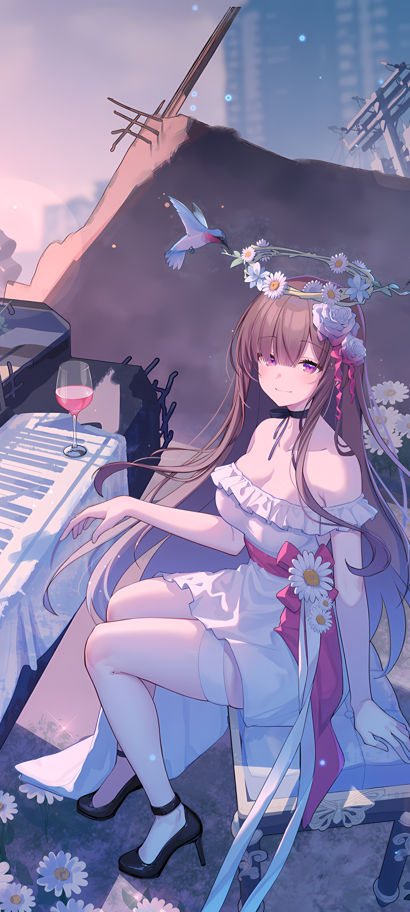
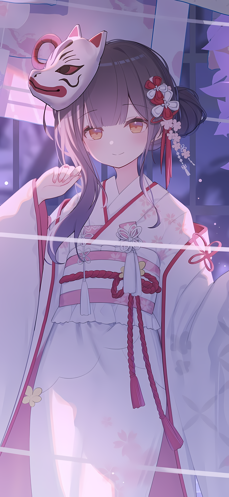
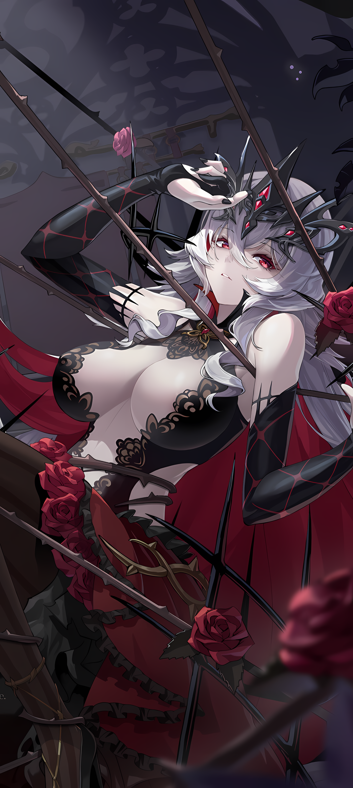
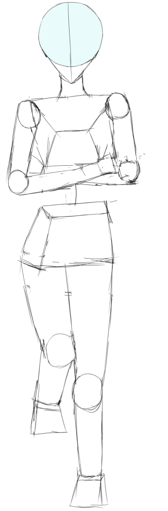
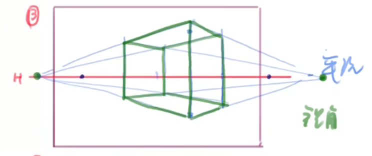
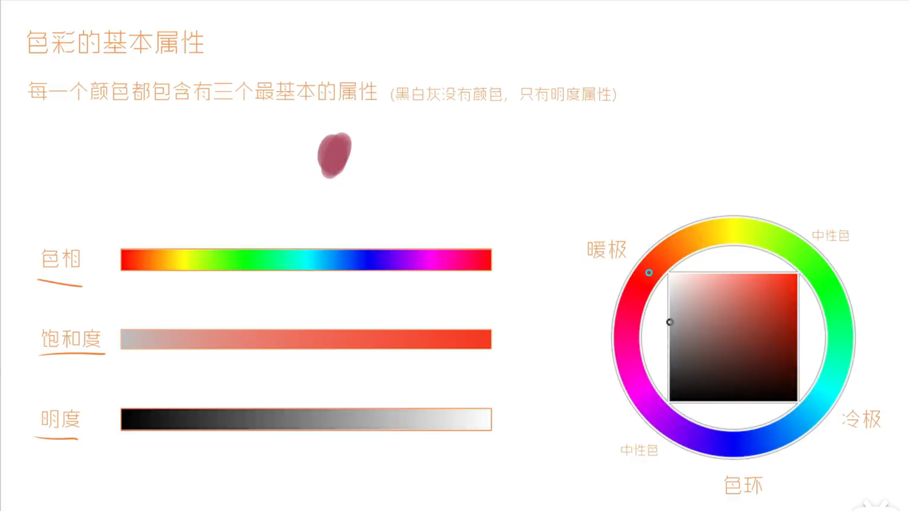
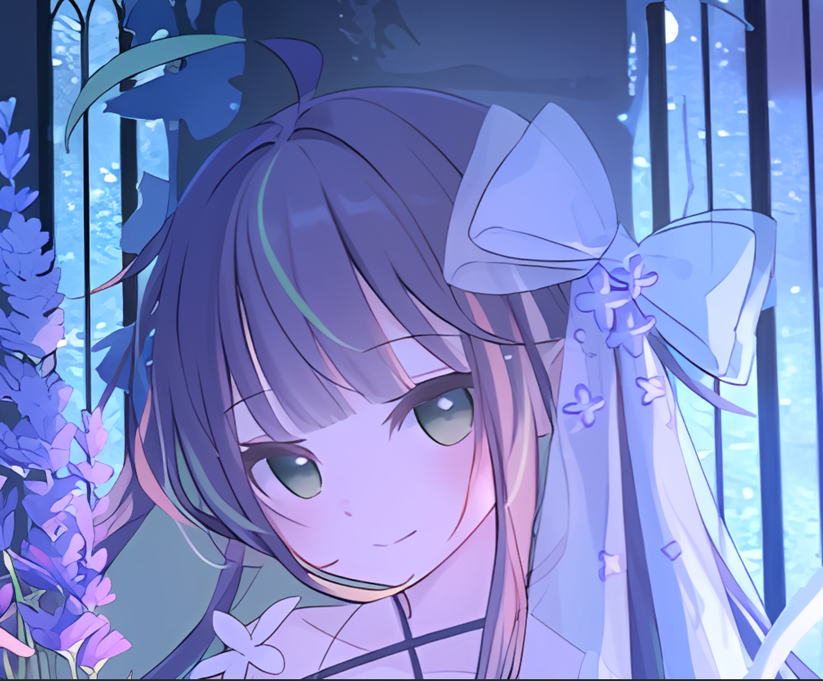

---
hide:
  - toc
---

# 绘画笔记

    <section class="home-hero">
        

            
DRAWING ROUTE / VISUAL ARCHIVE

            
绘画路线档案

            
睁开眼吧，世界空无一人。如果前面的光太微弱，如果走着走着累了，随时可以闭上眼睛，折返退回最初的起点。别害怕，在这里所有的停滞都无所谓。只要落笔，所有的错误都可以重来。

            

                <a class="home-action home-action--primary" href="流程/起草.html">01从起草开始</a>
                <a class="home-action home-action--cyan" href="专题/眼睛上色.html">02眼睛专题</a>
                <a class="home-action home-action--dark" href="色彩知识.html">03色彩整理</a>
            

            

                

                    <strong>03</strong>
                    基础板块
                

                

                    <strong>11</strong>
                    流程节点
                

                

                    <strong>05</strong>
                    专题笔记
                

            

        

        

            
            
            
        

    </section>

    <section class="home-news">
        <a href="基础知识.html">FOUNDATION基础知识汇总入口</a>
        <a href="绘画流程.html">PROCESS绘画流程节点入口</a>
        <a href="专题深入.html">DETAIL专题训练汇总入口</a>
    </section>
    
    <section class="route-panel">
        

            

                
LEARNING ROUTE

                
按作画顺序复盘，每一步都能回头查

            

            
从大结构到最后提亮，先把流程跑通，再回到专题页拆细节。

        

        

            <a class="flow-step" href="流程/起草.html">01起草<small>动态与体块</small></a>
            <a class="flow-step" href="流程/勾线.html">02勾线<small>线条取舍</small></a>
            <a class="flow-step" href="流程/固有色.html">03固有色<small>灰底铺色</small></a>
            <a class="flow-step" href="流程/二分.html">04二分<small>明暗分组</small></a>
            <a class="flow-step" href="流程/三分.html">05三分<small>弱结构补色</small></a>
            <a class="flow-step" href="流程/闭塞.html">06闭塞<small>接触暗部</small></a>
            <a class="flow-step" href="流程/灰面.html">07灰面<small>过渡塑形</small></a>
            <a class="flow-step" href="流程/高光.html">08高光<small>最后提亮</small></a>
            <a class="flow-step" href="流程/反光.html">09反光<small>暗部环境光</small></a>
            <a class="flow-step" href="流程/塑造.html">10塑造<small>材质与边缘</small></a>
            <a class="flow-step" href="流程/光源衰减.html">11光源衰减<small>距离与层级</small></a>
        

    </section>
    
    <section class="home-section">
        

            
CORE FILES

            <h2>基础知识</h2>
        

        

            <a class="hero-card" href="人体知识.html">
                
                

                    体
                    FOUNDATION
                

                
人体知识

                
比例、头肩颈、躯干和四肢体块，把角色从火柴人推到能塑造的结构。

                查看人体结构
            </a>
            <a class="hero-card" href="场景知识.html">
                
                

                    景
                    SPACE
                

                
场景知识

                
一点、两点、三点透视和结构概括，用空间关系托住人物。

                查看场景透视
            </a>
            <a class="hero-card" href="色彩知识.html">
                
                

                    色
                    COLOR
                

                
色彩知识

                
白色偏好、正片叠底、滤色和叠加，把图层混合变成可控工具。

                查看色彩笔记
            </a>
        

    </section>
    
    <section class="home-section">
        

            
PROCESS MAP

            <h2>绘画流程</h2>
        

        

            <a class="hero-card" href="流程/起草.html">
                
起STEP 01

                
起草

                
人体动态、体块概括、透视线，先把大结构立住。

                开始学习
            </a>
            <a class="hero-card" href="流程/勾线.html">
                
线STEP 02

                
勾线

                
粗细变化、闭塞、断线和蒙版，控制线稿的轻重与呼吸。

                查看流程
            </a>
            <a class="hero-card" href="流程/固有色.html">
                
底STEP 03

                
固有色

                
灰底铺色、固有色选择和特殊处理，先定画面的颜色秩序。

                查看流程
            </a>
            <a class="hero-card" href="流程/二分.html">
                
明STEP 04

                
二分

                
光源判断、阴影细化、叠加染色，把明暗关系分清楚。

                查看流程
            </a>
            <a class="hero-card" href="流程/三分.html">
                
三STEP 05

                
三分

                
腮红、弱结构阴影、眼白眼影和嘴唇，补上更细的色面变化。

                查看流程
            </a>
            <a class="hero-card" href="流程/闭塞.html">
                
暗STEP 06

                
闭塞

                
接触面、转折处、遮挡处，让暗部更有重量。

                查看流程
            </a>
            <a class="hero-card" href="流程/灰面.html">
                
灰STEP 07

                
灰面

                
选区笔刷、眼睫毛、眼球和头发画法，把过渡与塑形补齐。

                查看流程
            </a>
            <a class="hero-card" href="流程/高光.html">
                
光STEP 08

                
高光

                
面部高光和图层混合模式，让最后的亮点干净落位。

                查看流程
            </a>
            <a class="hero-card" href="流程/反光.html">
                
反STEP 09

                
反光

                
环境光反弹进暗部，暗中带色但不能亮过受光面。

                查看流程
            </a>
            <a class="hero-card" href="流程/塑造.html">
                
塑STEP 10

                
塑造

                
统一边缘、转折和材质，金属硬边高反差，皮肤布料保留软过渡。

                查看流程
            </a>
            <a class="hero-card" href="流程/光源衰减.html">
                
衰STEP 11

                
光源衰减

                
按距离压亮度和饱和度，拉开前后层级与视觉中心。

                查看流程
            </a>
        

    </section>
    
    <section class="home-section">
        

            
DETAIL TRAINING

            <h2>专题深入</h2>
        

        

            <a class="hero-card" href="专题/眼睛上色.html">
                
                
眼DETAIL

                
眼睛上色

                
瞳孔、虹膜、高光、反光和睫毛，处理角色最先被注意到的区域。

                阅读专题
            </a>
            <a class="hero-card" href="专题/头发塑造.html">
                
                
发FORM

                
头发塑造

                
二分细化、灰面、高光、反光和线稿染色，梳理发束体积。

                阅读专题
            </a>
            <a class="hero-card" href="专题/皮肤塑造.html">
                
肤SKIN

                
皮肤塑造

                
腮红、阴影、暗面、高光和面部细节，让肤色更透气。

                阅读专题
            </a>
            <a class="hero-card" href="专题/衣褶.html">
                
褶CLOTH

                
衣褶刻画

                
取舍思路、阴影刻画和简化完成，避免褶皱变成噪点。

                阅读专题
            </a>
            <a class="hero-card" href="专题/泳装衣褶.html">
                
泳MATERIAL

                
泳装衣褶

                
受力区域、材质贴合和褶皱简化，处理贴身布料的结构。

                阅读专题
            </a>
        

    </section>
    
    <section class="home-section home-section--courses">
        

            
COURSE ARCHIVE

            <h2>课程资源</h2>
        

        

            <template class="course-data">
[
  {
    "title": "v大预科",
    "direction": "综合基础",
    "href": "基础知识.html",
    "kicker": "PAID COURSE / FOUNDATION",
    "desc": "用来补最核心的造型、比例、体块和画面基础。适合作为长期回查的底层课程。",
    "note": "先把人体、空间和明暗关系跑通，再接后面的专题细化。",
    "img": "img/体块概括.png"
  },
  {
    "title": "kana匠人绘粒子课",
    "direction": "日系胸像",
    "href": "专题/头发塑造.html",
    "kicker": "PAID COURSE / CHARACTER",
    "desc": "偏向角色头像、脸部与头发塑造，适合用来拆角色完成度和局部精修。",
    "note": "画胸像时优先回看：五官、头发体积、边缘处理和画面干净度。",
    "img": "img/螳螂鬓.png"
  },
  {
    "title": "咸鱼中下游公益色彩课",
    "direction": "色彩入门",
    "href": "色彩知识.html",
    "kicker": "PUBLIC COURSE / COLOR",
    "desc": "整理色相、灰度、冷暖和图层混合模式，解决颜色脏、灰、乱的问题。",
    "note": "每次上色前先检查黑白关系，再看冷暖和纯度，不要一上来就堆滤镜。",
    "img": "img/色相.png"
  },
  {
    "title": "散修炼体",
    "direction": "零散补充",
    "href": "绘画流程.html",
    "kicker": "PRACTICE NOTES / EXTRA",
    "desc": "放没有归入主线课程的小技巧、小练习和临时补丁，用来补当前最短的短板。",
    "note": "适合画到卡壳时快速翻，不作为主线推进，只补具体问题。",
    "img": "img/结构概括总图.png"
  },
  {
    "title": "k大三件套",
    "direction": "核心基础",
    "href": "基础知识.html",
    "kicker": "COURSE / CORE",
    "desc": "放在基础路线里的核心课位，适合和人体、透视、明暗一起反复对照。",
    "note": "学完后可以直接从这里删掉，页面结构不会受影响。",
    "img": "img/结构概括总图.png"
  },
  {
    "title": "han0v0",
    "direction": "待补充",
    "href": "基础知识.html",
    "kicker": "COURSE / SLOT",
    "desc": "先作为课程槽位保留，后面可以把对应主题、截图或复盘补进来。",
    "note": "学完就删，不需要单独区分免费或付费。",
    "img": "img/火柴人.jpg"
  },
  {
    "title": "元大",
    "direction": "待补充",
    "href": "绘画流程.html",
    "kicker": "COURSE / SLOT",
    "desc": "先挂到流程路线里，之后按实际学习内容改成对应方向。",
    "note": "这里只负责存入口和提醒，不把课程拆成额外分类。",
    "img": "img/概括过程1.png"
  },
  {
    "title": "山药",
    "direction": "待补充",
    "href": "绘画流程.html",
    "kicker": "COURSE / SLOT",
    "desc": "作为待学习课程入口，后面可替换成笔记页或专题页链接。",
    "note": "学完后删掉这一条即可，右侧展示会自动回到其他课程。",
    "img": "img/概括过程2.png"
  },
  {
    "title": "毛厂",
    "direction": "待补充",
    "href": "专题深入.html",
    "kicker": "COURSE / SLOT",
    "desc": "先放在专题路线里，等学习内容明确后再改说明和配图。",
    "note": "这块是临时学习清单，不会和最终笔记绑定死。",
    "img": "img/概括过程3.png"
  },
  {
    "title": "翔腿颓",
    "direction": "待补充",
    "href": "专题深入.html",
    "kicker": "COURSE / SLOT",
    "desc": "课程入口先占位，适合后续补局部专题或流程复盘。",
    "note": "可以把这里当待办，学完删条目就好。",
    "img": "img/典型曲面.png"
  },
  {
    "title": "Coloso",
    "direction": "待补充",
    "href": "色彩知识.html",
    "kicker": "COURSE / SLOT",
    "desc": "先作为综合课程入口保留，后面按实际内容归到色彩、流程或专题。",
    "note": "只放在同一个课程模板里，不再额外拆分。",
    "img": "img/莉莉的白色.png"
  },
  {
    "title": "fuwari",
    "direction": "待补充",
    "href": "专题深入.html",
    "kicker": "COURSE / SLOT",
    "desc": "课程入口先留在这里，等学完再按实际主题归到专题、流程或基础里。",
    "note": "这条是待学课程，不是音乐名；学完后可以直接删掉这个对象。",
    "img": "img/眼睛.png"
  },
  {
    "title": "芜菁f",
    "direction": "待补充",
    "href": "绘画流程.html",
    "kicker": "COURSE / SLOT",
    "desc": "作为待学习课程槽位保留，后面补主题、截图或链接即可。",
    "note": "不用区分付费免费，当前模板只负责把课程存进路线里。",
    "img": "img/色相.png"
  },
  {
    "title": "曼奇立德",
    "direction": "待补充",
    "href": "基础知识.html",
    "kicker": "COURSE / SLOT",
    "desc": "先挂在课程列表中，等学习内容明确后再替换描述和配图。",
    "note": "学完后删掉这段 JSON 对象，页面会自动重排。",
    "img": "img/结构概括总图.png"
  }
]
            </template>
            <nav class="course-roster" aria-label="课程列表"></nav>
    
            <a class="course-feature" href="基础知识.html">
                

                    
PAID COURSE / FOUNDATION

                    <h3>v大预科</h3>
                    
用来补最核心的造型、比例、体块和画面基础。适合作为长期回查的底层课程。

                    <dl class="course-feature__meta">
                        

                            <dt>方向</dt>
                            <dd class="course-feature__direction">综合基础</dd>
                        

                    </dl>
                    
先把人体、空间和明暗关系跑通，再接后面的专题细化。

                

                <figure class="course-feature__art">
                    
                </figure>
            </a>
    
            <aside class="course-checks" aria-label="画前检查">
                <h3>画前检查</h3>
                

                    
参
<strong>找参考</strong> 把参考拆成姿势、光影、材质和氛围，别混在一张图里硬抄。

                    
灰
<strong>查灰度</strong> 最上方放一个黑白饱和度图层，先看整体明暗关系。

                

            </aside>
        

    </section>

