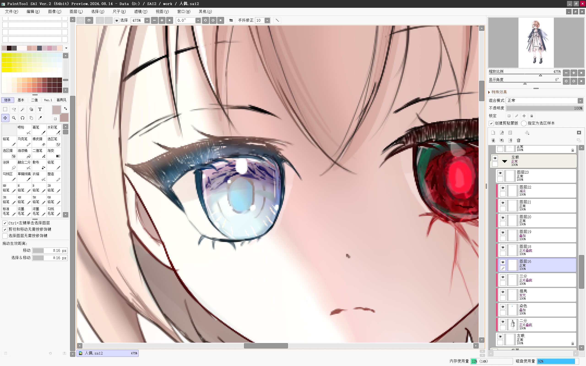
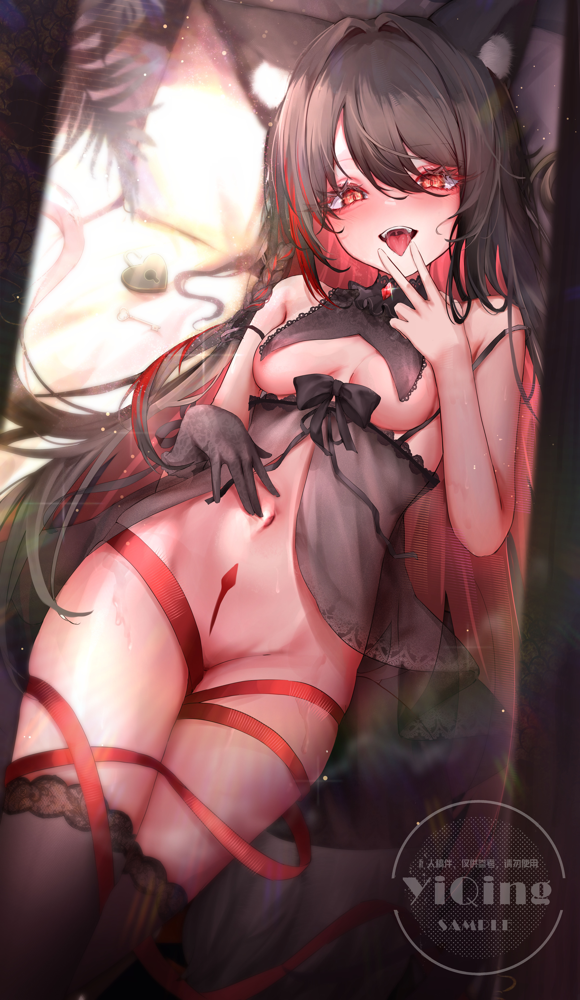

# 眼睛塑造

---

## 瞳孔与虹膜

- 新建**普通图层**画瞳孔，新建图层画虹膜
- **瞳孔位置**：找角度相近的参考比理论更有效。例如脸朝右下，瞳孔就稍偏左上；侧边的眼睛转折可更明显，瞳孔偏小

---

## 颜色与反光

- 在虹膜图层下新建图层（可用**叠加**模式），用喷枪提高下半部分饱和度，制造上深下浅效果
- 取其他颜色，添加阳光反光（与脸部塑造思路一致）

---

## 特殊处理

- 暗部画出杂乱无规则的感觉的**高饱和度**暗色块
- 靠近睫毛处使用**高明度**的笔触塑造闪亮的眼睛
- 使用套索加其他颜色喷枪在眼睛内部塑造，目的是为了体现眼睛的**玻璃感**

---

## 高光与反光

- 新建**强光**图层画高光和反光
- **高光形状**：可做变化，如一大一小的组合，或类似水滴的处理。可在白色高光边缘加一些高饱和的颜色
- **反光处理**：先用选区笔画出丝状结构，再用喷枪喷出黄色反光，最后模糊过渡

---

## 发光效果与细节

- 继续新建**发光**图层进行提亮
- 先用黄色喷底部，再用硬笔画零星光点，制造模糊光斑，让眼睛散发光亮
- 可尝试形状和颜色对比变化（如在蓝色上画红色，在红色上画蓝色），添加星光、爱心等元素

---

## 眼球反光与强反光

- 切换到**普通图层**，选偏中性或冷灰色，用橡皮擦出窗户或睫毛投影的形状（偏向矩形或三角形），与整体圆形形成对比
- **强反光**：模拟眼球表面水分接触眼皮形成的反光，有现实依据。眼睛占画面比例小，可大胆添加细节，只要做好明暗、冷暖对比即可

---

## 睫毛处理

- 切换到**线稿图层**处理睫毛，先让暗部足够暗，用深色进行更细致的铺陈
- **透光感**：在睫毛上新建普通图层，用选区笔加喷枪的组合，排线一些高亮度的红色，画出睫毛的透光感。下睫毛同理，也可在眼睛线稿上点类似光斑
- **反光**：习惯在睫毛底端做一条接近肤色的反光，中间区域加入环境色（如眼球的蓝、粉，光源的黄，流萤配色的蓝绿）
- **最终效果**：用深色硬笔画出睫毛根根分明的效果，最后用纯白色画出睫毛高光
