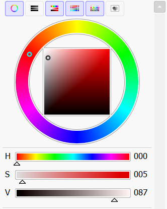

---
hide:
  - toc
---

# 作品集

<!--
添加新作品时，复制 portfolio-roster 里的一个 a，并同步修改 data-preview-* 字段。
图片放到 docs/img/ 后，把 data-preview-img、data-target-href 和 img src 改成对应路径即可。
字段建议：
- data-preview-title：作品名字
- data-preview-date：完成日期
- data-preview-desc：作品简介
- data-preview-note：心得/复盘
- data-preview-role：展示标签，可以写主题、角色名或练习方向
-->

    <section class="portfolio-showcase" aria-label="作品集展示">
        <nav class="portfolio-roster" aria-label="作品列表">
            <a class="is-active" href="#portfolio-01" data-target-href="img/眼睛.png" data-preview-kicker="PORTFOLIO / 01" data-preview-rank="A RANK" data-preview-role="成图档案" data-preview-title="未命名作品 01" data-preview-date="2026-05-17" data-preview-desc="这里写作品简介：主题、角色、画面重点，或者这张图想解决的问题。" data-preview-note="这里写心得：这次满意的地方、踩坑的地方、下一张想改的地方。" data-preview-img="img/眼睛.png" data-preview-accent="#47e8ff">01</a>
            <a href="#portfolio-02" data-target-href="img/螳螂鬓.png" data-preview-kicker="PORTFOLIO / 02" data-preview-rank="B RANK" data-preview-role="过程记录" data-preview-title="未命名作品 02" data-preview-date="待补充" data-preview-desc="这里可以写构图、色彩、人物设定或练习目标。" data-preview-note="这里可以写复盘，比如明暗、边缘、材质或节奏哪里还要调整。" data-preview-img="img/螳螂鬓.png" data-preview-accent="#ff4fa1">02</a>
            <a href="#portfolio-03" data-target-href="img/莉莉的白色.png" data-preview-kicker="PORTFOLIO / 03" data-preview-rank="C RANK" data-preview-role="练习复盘" data-preview-title="未命名作品 03" data-preview-date="待补充" data-preview-desc="这里放作品简介，保持短一点，读起来更像角色档案。" data-preview-note="这里写心得，记录你这张图真正学到的东西。" data-preview-img="img/莉莉的白色.png" data-preview-accent="#f5d55f">03</a>
        </nav>

        <a class="portfolio-card" href="img/眼睛.png" style="--portfolio-accent: #47e8ff;">
            
PORTFOLIO

            

                

                    A RANK
                    <strong class="portfolio-rank__name">成图档案</strong>
                

                
PORTFOLIO / 01

                <h3>未命名作品 01</h3>
                
成图档案

                

                <dl class="portfolio-meta">
                    

                        <dt>完成日期</dt>
                        <dd class="portfolio-date">2026-05-17</dd>
                    

                </dl>
                <section class="portfolio-field">
                    <h4>作品简介</h4>
                    
这里写作品简介：主题、角色、画面重点，或者这张图想解决的问题。

                </section>
                <section class="portfolio-field">
                    <h4>心得</h4>
                    
这里写心得：这次满意的地方、踩坑的地方、下一张想改的地方。

                </section>
            

            <figure class="portfolio-art">
                
                <figcaption>点击查看原图</figcaption>
            </figure>
        </a>
    </section>

