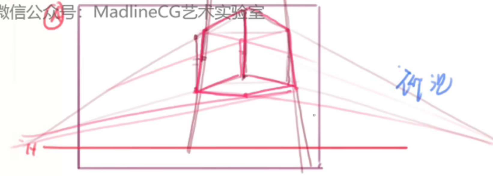
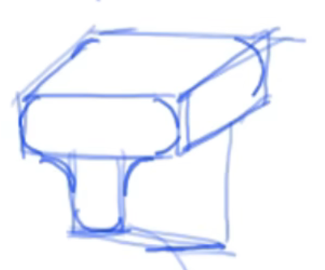

# 场景知识

## 平视

### 一点透视

整个画面只有一个消失点人物对着平面，一般多出现在平视的情况下

### 两点透视

当人物平视时看到的是角（或者说是侧面）的情况下，会产生俩个消失点，这就是俩点透视

## 俯视和仰视

俯视和仰视会产生三个消失点，且俯视的其中一个消失点在下，仰视的其中一个消失点在上

## 结构概括

和平面概括类似，不过变成了立体概括，先转化为一个大致的方块，然后在方块之中做出变化

1.用球柱方锥的几何来概括物体大致的雏形轮廓

2.一些曲面：

与球柱方锥组合来概括物体

