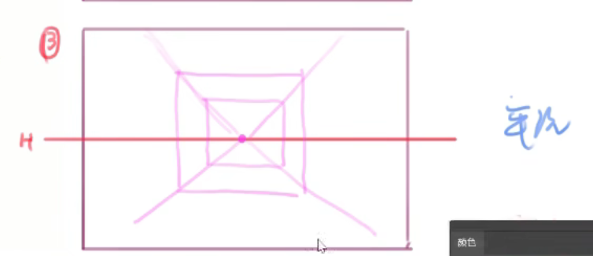
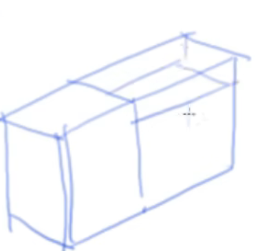
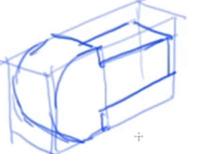
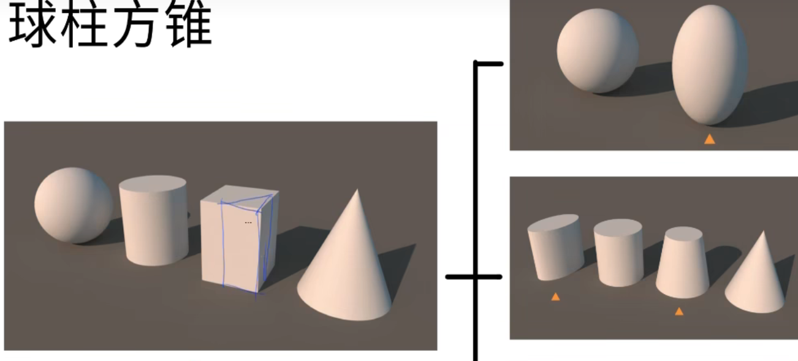
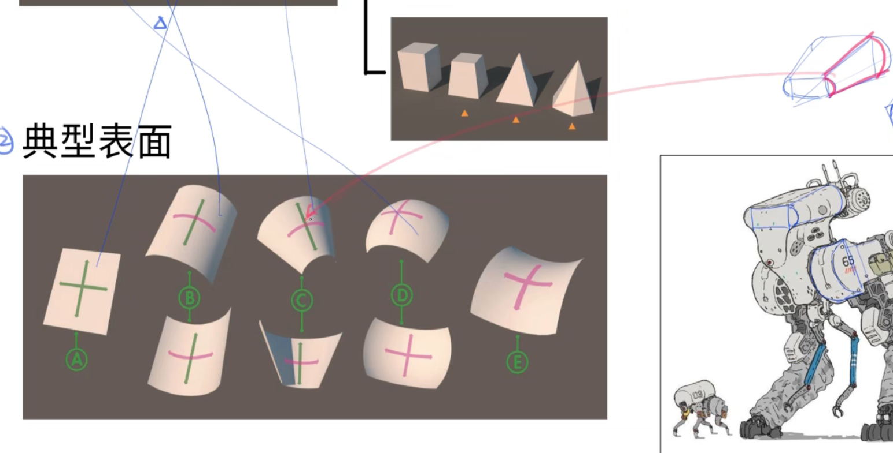

# 场景知识

## 平视

    

        1 个消失点
        <h4>一点透视</h4>
        
整个画面只有一个消失点，人物对着平面，一般多出现在平视的情况下

    

    

        2 个消失点
        <h4>两点透视</h4>
        
当人物平视时看到的是角（或者说是侧面）的情况下，会产生两个消失点

    

### 一点透视

### 两点透视

---

## 俯视和仰视

    3 个消失点
    <h4>三点透视</h4>
    
俯视和仰视会产生三个消失点。俯视的其中一个消失点在<strong>下方</strong>，仰视的其中一个消失点在<strong>上方</strong>

---

## 结构概括

和平面概括类似，不过变成了立体概括，先转化为一个大致的方块，然后在方块之中做出变化

    

        <h4>概括过程</h4>
        
        
        
    

    

        <h4>基础几何体</h4>
        
用<strong>球柱方锥</strong>的几何来概括物体大致的雏形轮廓

        
    

### 曲面概括

与球柱方锥组合来概括物体

