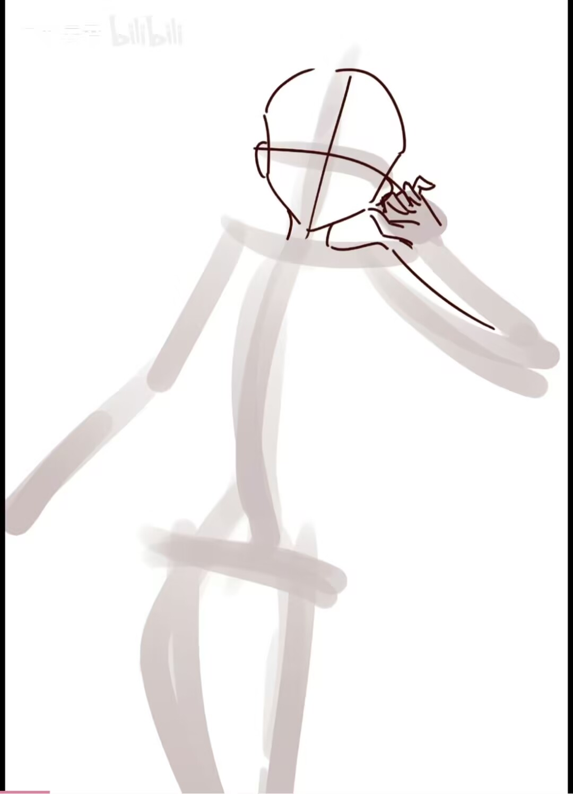

# 起草

## 人体

体块概括：

注意：画的过程中多使用H键左右翻转避免结构错误

### 1.线条定好大致人物动态和比例

### 2.体块概括人物

(1).头部用球和用三角连接的下巴概括     (2).关节用球来概括     (3).大臂小臂以及大腿小腿都使用圆柱来概括

(4).胸腔使用长方体概括     (5).盆骨处用棱台概括     (6).脚

### 3.体块转换为大致的骨架和肌肉

关键点在于找好中线

---

## 场景

### 1.画透视线
