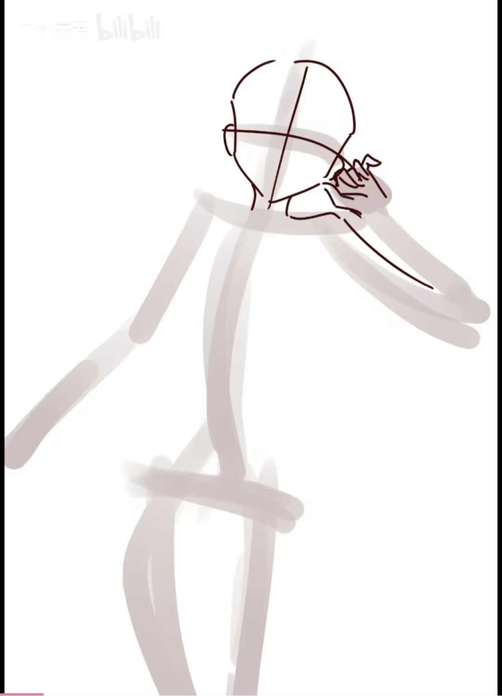
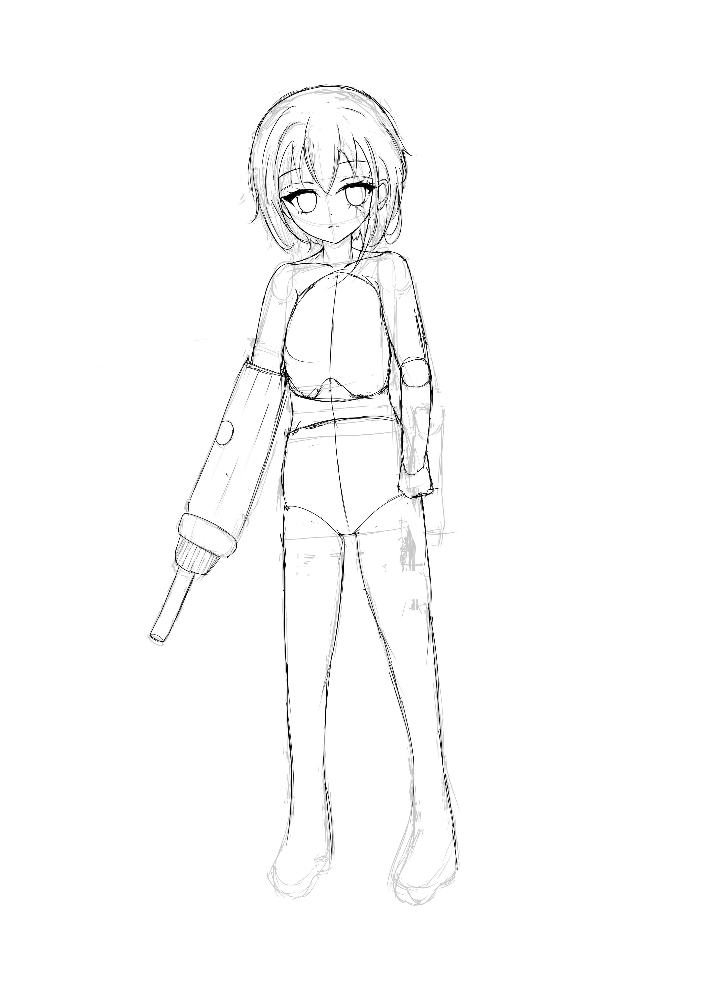

# 起草

## 人体

- **注意**：画的过程中多使用 `H` 键左右翻转，避免结构错误

### 线条定好大致人物动态和比例

### 体块概括人物

- 头部用球和用三角连接的下巴概括
- 关节用球来概括
- 大臂小臂以及大腿小腿都使用圆柱来概括
- 胸腔使用长方体概括
- 盆骨处用棱台概括
- 脚

### 体块转换为大致的骨架和肌肉

- 关键点在于找好中线
- 背诵常见的骨骼肌肉

---

## 场景

### 画透视线
