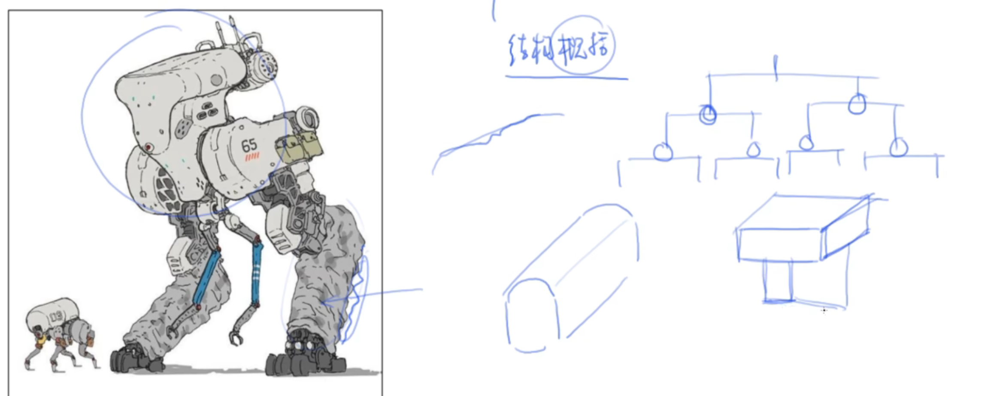

---
hide:
  - toc
---

# 绘画流程

    <section class="hub-hero hub-hero--compact">
        
PROCESS MILESTONE

        <h2>按作画顺序推进，每一步都能回跳</h2>
        
先看整条路线，再进某个节点复盘。卡住时按编号回跳，不用从头翻。

    </section>

    <section class="process-board" aria-label="绘画流程入口">
        

            
            ROUTE 01-11
        

        

            <a class="process-node is-hot" href="流程/起草.html">01<strong>起草</strong><small>动态与体块</small></a>
            <a class="process-node" href="流程/勾线.html">02<strong>勾线</strong><small>线条取舍</small></a>
            <a class="process-node" href="流程/固有色.html">03<strong>固有色</strong><small>灰底铺色</small></a>
            <a class="process-node" href="流程/二分.html">04<strong>二分</strong><small>明暗分组</small></a>
            <a class="process-node" href="流程/三分.html">05<strong>三分</strong><small>弱结构补色</small></a>
            <a class="process-node" href="流程/闭塞.html">06<strong>闭塞</strong><small>接触暗部</small></a>
            <a class="process-node" href="流程/灰面.html">07<strong>灰面</strong><small>过渡塑形</small></a>
            <a class="process-node" href="流程/高光.html">08<strong>高光</strong><small>最后提亮</small></a>
            <a class="process-node is-muted" href="流程/反光.html">09<strong>反光</strong><small>待补完</small></a>
            <a class="process-node is-muted" href="流程/塑造.html">10<strong>塑造</strong><small>待补完</small></a>
            <a class="process-node is-muted" href="流程/光源衰减.html">11<strong>光源衰减</strong><small>待补完</small></a>
        

    </section>

